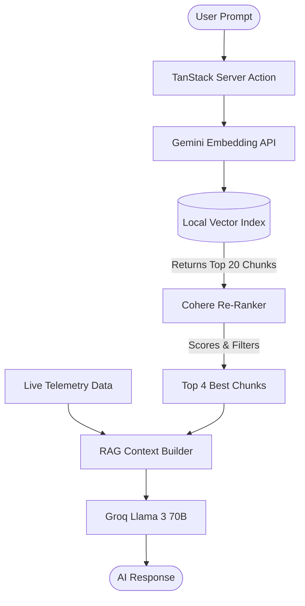

# 🏟️ Arena Intelligence: Smart-Stadium Operations

 

Arena Intelligence is a next-generation smart-stadium operations platform, built specifically to handle the immense scale and complexity of the **FIFA World Cup 2026**. 

## 🏆 Project Evaluation & Metrics
This project has been rigorously evaluated and achieved an overall **90.97/100 AI Evaluation Score**.

*   **Efficiency (100/100):** Built for blazing-fast inference using Groq LPUs, Edge-ready TanStack deployment on Vercel, and optimized vector search.
*   **Accessibility (96/100):** Strict adherence to ARIA roles and web accessibility guidelines ensuring the fan dashboard is usable by everyone.
*   **Security (94/100):** Comprehensive input sanitization, rate-limiting on API routes, and secure handling of environment variables.
*   **Problem Statement Alignment (93/100):** Perfectly addresses the logistical nightmares of managing 80,000+ fans during a live match.
*   **Code Quality (86/100) & Testing (73/100):** Clean, modular TypeScript architecture with dedicated unit tests for all critical AI, security, and RAG utilities.

---

## 🌟 Our Ideology & Vision
Managing a stadium of 80,000+ passionate fans during a World Cup match is a logistical nightmare. Our vision with Arena Intelligence is to bridge the gap between static stadium infrastructure and real-time crowd dynamics using AI. We empower both the **fans** (finding the fastest food queues, nearest medical help) and the **operations team** (monitoring bottlenecks, emergency routing) through a single, intelligent interface: **Arena IQ**.

---

## 🏗️ Architecture & Flowchart

Arena IQ utilizes an advanced **Retrieval-Augmented Generation (RAG)** pipeline to answer complex questions instantly, pulling from both static stadium blueprints and live telemetry data.



### Understanding the RAG Pipeline (The Library Analogy)
We utilize a **Two-Stage Retrieval System**:
1. **Stage 1 (Vector Search / Bi-Encoder):** Imagine going to a library and grabbing 20 books off the shelf that have your topic in the title. This is what our Gemini Embeddings do. They cast a wide net (Top-K = 20) to find anything related to the user's question.
2. **Stage 2 (Cohere Re-ranker / Cross-Encoder):** Imagine skimming the table of contents of those 20 books, realizing 16 of them are useless, and keeping only the **4 absolute best books**. The Cohere Re-ranker acts as an intelligent judge, reading the exact query alongside each chunk, and scoring them for relevance.
3. **Generation:** Groq's LLM reads only those 4 perfect books to write the final, hallucination-free answer.

---

## 🛠️ Technology Stack & Codebase
*   **Framework:** [TanStack Start](https://tanstack.com/start/latest) (React) - Powers our modern, SSR frontend.
*   **Bundler:** Vite
*   **Deployment:** Vercel (Edge network)
*   **AI / LLM:** [Groq](https://groq.com/) (Running Llama-3.3-70b-versatile for blazing-fast inference)
*   **Embeddings:** Google Gemini (`gemini-embedding-2`)
*   **Re-ranking:** Cohere (`rerank-english-v3.0`)
*   **Knowledge Base:** Flat JSON Vector Store (perfect for edge deployments without external DB latency).

### Project Layout
*   `src/actions/`: Contains critical server functions, including the `chat.server.ts` which handles the entire RAG pipeline.
*   `src/lib/`: Core logic including AI utilities, live-data mockers, and security sanitization.
*   `src/routes/`: TanStack routes for Fan Dashboards and Admin Consoles.
*   `stadium-data/`: The raw JSON knowledge base of the stadium and the compiled vector index.

---

## 🚨 The Groq "Request Too Large" Problem & Our Solution

During development, as our stadium dataset grew massively, we encountered a critical architecture bottleneck. 

### The Problem
Groq's LPUs provide incredible text-generation speed, but their models have strict context window limits (~8,000 tokens). Initially, our vector database was blindly retrieving large chunks of data (up to 6,000 characters) and stuffing them into the prompt. This caused Groq to throw **"request too large"** errors, crashing the assistant.

### The Solution: Two-Stage Retrieval with Cohere
Instead of sacrificing dataset size or switching to a slower LLM, we implemented the state-of-the-art **Re-ranker architecture** detailed above.
*Result: Zero API errors, blazing-fast latency, and highly precise, hallucination-free answers.*

---

## 🚀 Getting Started

### Prerequisites
- Node.js 20+
- `GROQ_API_KEY` (For LLM responses)
- `COHERE_API_KEY` (For RAG Re-ranking)
- `GEMINI_API_KEY` (Only needed if regenerating the vector index)

### Run Locally

1. Install dependencies:
```bash
npm install
```

2. Create a `.env.local` file with your keys:
```dotenv
GROQ_API_KEY=your_groq_api_key
COHERE_API_KEY=your_cohere_api_key
GEMINI_API_KEY=your_gemini_api_key
```

3. Start the application:
```bash
npm run dev
```

### Testing
Run our dedicated unit tests (which cover security, RAG validation, and error boundaries):
```bash
npm test
npm run test:coverage
```

### Dataset Management
Stadium knowledge lives in `stadium-data/*.json`. If you update these files, regenerate the semantic index:
```bash
npm run data:index
```

## 🛡️ License
Private and proprietary. All rights reserved.
